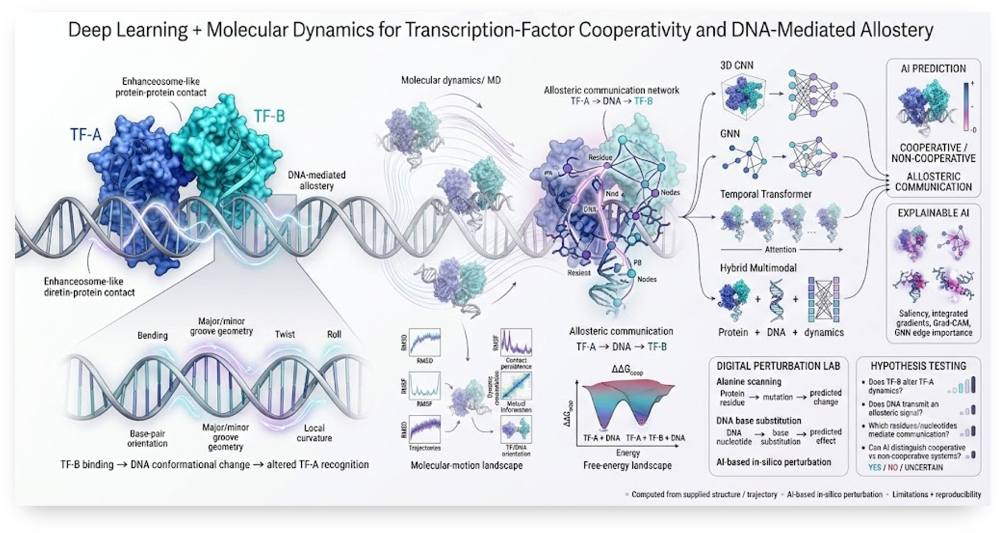
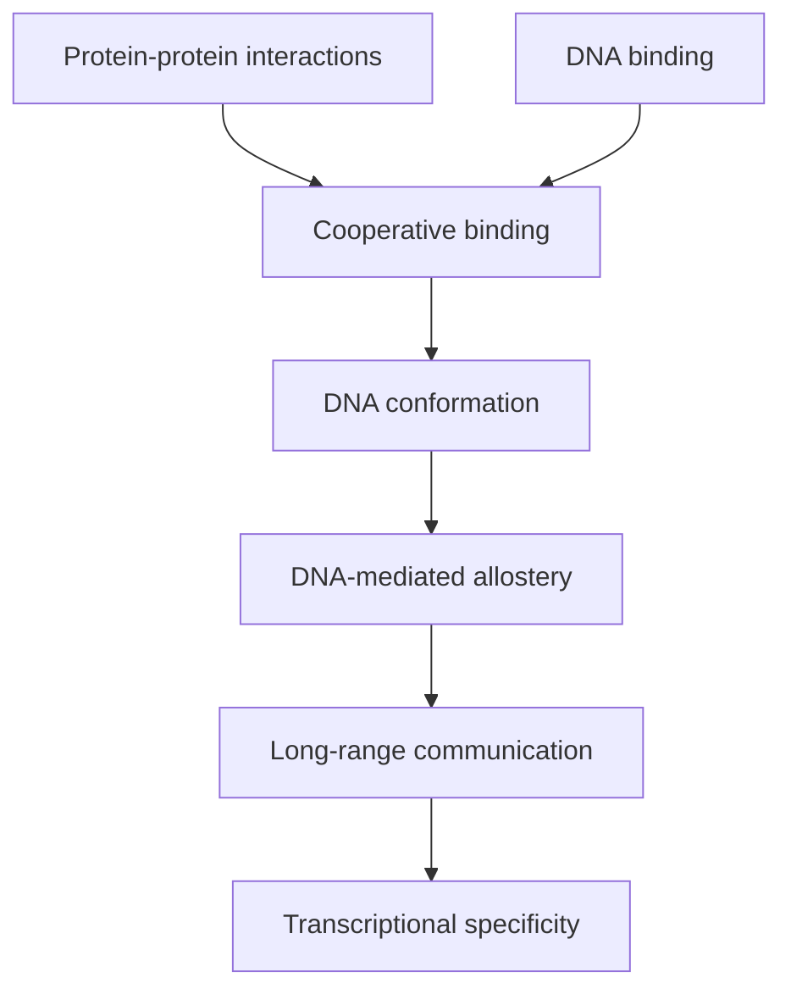
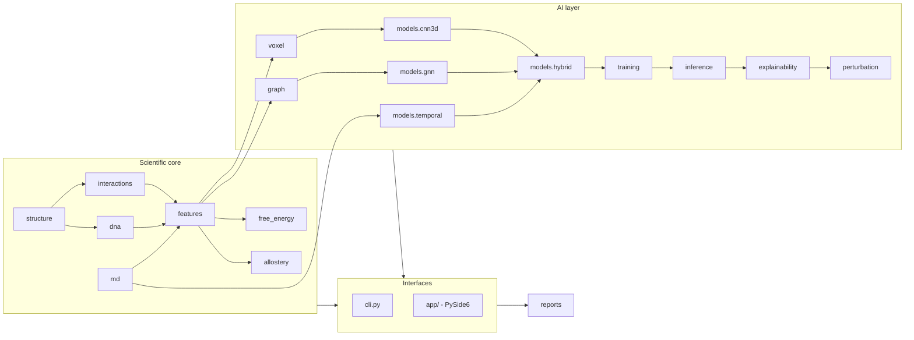

# EnhancoAI
<p align="center">
  <a href="img/Pic.jpg" target="_blank">
    
  </a>
</p>
**Deep learning, molecular dynamics and AI analysis of transcription-factor cooperativity and DNA-mediated allostery.**

EnhancoAI is a general-purpose research platform for investigating how
combinations of transcription factors (TFs) cooperatively recognise DNA,
how protein-protein interactions modify DNA recognition, and how DNA
itself can mediate allosteric communication between distant binding sites.
The motivating biological system is the OCT4-SOX2 enhanceosome, but the
software is not hard-coded to any single complex -- it analyses arbitrary
protein-DNA structures and trajectories.

> **No fake science.** Every quantitative result EnhancoAI reports is
> either computed directly from the structure/trajectory you supply, or
> is explicitly labelled as unavailable (e.g. "Model weights unavailable"),
> exploratory, or an AI-based in-silico perturbation. See
> [Limitations](#limitations).


## Overview



## Scientific motivation

Three interconnected mechanisms are investigated:

- **Direct cooperativity** -- Protein A physically contacts Protein B.
- **DNA-mediated allostery** -- Protein A and Protein B need not touch;
  binding of one changes DNA structure/dynamics/electrostatics and thereby
  modifies the other's binding behaviour.
- **Latent DNA specificity** -- A TF may recognise/stabilise DNA
  configurations that are weakly recognised in isolation.

See [`docs/scientific_background.md`](docs/scientific_background.md) for
the full list of research questions (Q1-Q10) this platform is designed to
help answer.

## Key questions

Does TF-B change TF-A's orientation, dynamics, or binding free-energy
landscape? Can DNA transmit an allosteric signal between two TFs? Which DNA
regions and protein residues mediate that communication? Can cooperative
and non-cooperative TF pairs be told apart by machine learning? See the
in-app **Hypothesis Testing** dashboard, which links every YES/NO/UNCERTAIN
answer to a quantitative measurement.

## Features

- **Structure**: PDB/mmCIF loading, automatic Protein/DNA/RNA/Ligand chain
  classification, alternate-location resolution, missing-atom reporting.
- **Interactions**: protein-DNA and protein-protein contact/H-bond/salt-bridge
  detection, buried-surface-area (SASA), residue-resolution contact maps.
- **DNA geometry**: simplified base-pair step parameters (twist/roll/tilt/
  rise/slide/shift), curvature, groove width -- documented approximations,
  used when a dedicated tool (3DNA/Curves+) is unavailable.
- **MD analysis**: RMSD, RMSF, contact persistence, dynamic cross-correlation,
  mutual information, TF/DNA orientation trajectories (MDAnalysis-backed).
- **Free energy**: 1D/2D PMFs from equilibrium histograms with explicit
  sample-size warnings, and a documented cooperativity free-energy metric
  (ΔΔG_coop).
- **Allostery**: protein-residue + DNA-nucleotide communication graphs
  (contacts, DCCM, mutual information), shortest-path pathway ranking,
  centrality, community detection.
- **AI**: four real PyTorch architectures -- 3D CNN, GNN, temporal
  Transformer, and a multi-task hybrid model with cross-modal attention.
- **Explainability**: saliency, integrated gradients, Grad-CAM, GNN edge
  importance, all implemented on plain `torch.autograd` (no extra
  dependency required).
- **Digital perturbation lab**: alanine scanning, DNA base substitution
  scanning, and a combined Protein-DNA Cooperativity Interaction Map --
  always labelled "AI-based in-silico perturbation".
- **Visualisation**: PyVista when installed, matplotlib fallback otherwise
  -- structure, contacts, DCCM, allosteric networks, AI attribution overlays.
- **Reports**: HTML + PDF, 16 sections, always ending in Limitations +
  Reproducibility Information.

## Architecture



## GUI

A PySide6 desktop app with tabs: **Project** (dashboard), **Structure**,
**Interactions**, **MD**, **Cooperativity**, **AI**, **Visualisation**, and
**Hypothesis Testing**. See [`docs/gui.md`](docs/gui.md).

## Installation

```bash
git clone <repository>
cd EnhancoAI

conda env create -f environment.yml
conda activate enhancoai
pip install -e .

# or, with plain pip:
pip install -e ".[dev]"
```

Optional (not required for core functionality):

```bash
pip install -e ".[full]"   # biotite, pyvista, pyvistaqt, torch_geometric
```

See [`docs/installation.md`](docs/installation.md) for GROMACS/OpenMM/
PLUMED/DSSP/FreeSASA integration notes.

## Quick start

```bash
python scripts/generate_demo_dataset.py   # DEMO DATA -- NOT SCIENTIFICALLY VALIDATED
enhancoai gui
# or, from the CLI:
enhancoai structure --input data/examples/demo_tf_dna_two_factor.pdb
enhancoai contacts --structure data/examples/demo_tf_dna_two_factor.pdb \
    --protein A --protein B --dna C --dna D
```

## OCT4-SOX2 example

The demo generator's two-factor / single-factor structure pair is the
generic analogue of the OCT4+SOX2+DNA vs OCT4+DNA comparison (section 54
of the design spec): run `enhancoai contacts` and `scripts/analyse_md.py`
on both `demo_tf_dna_two_factor.pdb` and `demo_tf_dna_single_factor.pdb`
and compare. To use real OCT4/SOX2 structures, substitute their PDB files
and chain IDs -- EnhancoAI computes everything from what you supply; no
OCT4/SOX2-specific behaviour or expected result is hard-coded anywhere.

## MD analysis

```bash
enhancoai md --topology system.pdb --trajectory trajectory.xtc
python scripts/analyse_md.py --topology system.pdb --trajectory trajectory.xtc
```

## Free-energy analysis

```bash
python scripts/calculate_pmf.py --input samples.csv --column com_distance
enhancoai cooperativity --system-a system_A.csv --system-ab system_AB.csv
```

## Allosteric networks

```bash
enhancoai allostery --topology system.pdb --trajectory trajectory.xtc
```

## AI models

Four architectures, selected via `model.architecture` in a YAML config:
`cnn3d`, `gnn`, `temporal`, `hybrid` (default). See
[`docs/ai_models.md`](docs/ai_models.md).

## Explainability

```bash
enhancoai explain --model models/pretrained/model.pt --target cooperativity
```

## Digital perturbation laboratory

`enhancoai.perturbation` (alanine scanning, DNA base scanning, the
combined interaction map) runs AI-model predictions under a perturbed
input representation -- always reported as *AI-based in-silico
perturbation*, distinct from a real molecular simulation.

## Dataset format

Samples are stored as `.pt` tensors described by a `metadata.json`
(sample_id, protein_a, protein_b, dna, structure_path, trajectory_path,
cooperativity_label, mechanism_label, cooperativity_value, split). See
[`scripts/build_dataset.py`](scripts/build_dataset.py) and
[`docs/ai_models.md`](docs/ai_models.md). Splits are clustered by
approximate protein sequence identity to avoid structural leakage between
train/val/test (section 40).

## Training

```bash
python scripts/train.py --config configs/training.yaml \
    --dataset-dir data/processed/demo_training --experiment-name run_001
```

Every run writes `experiments/<name>/{config.yaml,metrics.json,history.csv,
checkpoint.pt,figures/}`.

## CLI

```text
enhancoai gui
enhancoai structure --input complex.pdb
enhancoai contacts --structure complex.pdb --protein A --protein B --dna C
enhancoai md --topology system.tpr --trajectory trajectory.xtc
enhancoai cooperativity --system-a system_A --system-ab system_AB
enhancoai allostery --trajectory trajectory.xtc --topology system.pdb
enhancoai train --config configs/training.yaml
enhancoai predict --model models/pretrained/model.pt --input project/
enhancoai explain --model models/pretrained/model.pt --target cooperativity
enhancoai report --project project/
```

## Reproducibility

Every analysis can export input hashes, software/PyTorch/CUDA versions,
parameters, random seed and a timestamp via
`enhancoai.utils.reproducibility.ReproducibilityRecord.export()`. See
[`docs/reproducibility.md`](docs/reproducibility.md).

## Limitations

- MD sampling may be incomplete; PMFs depend on reaction-coordinate choice
  and sampling, and are labelled by method/sample count, not presented as
  converged unless the input warrants it.
- Correlation (DCCM/mutual information) does not prove causal allosteric
  communication.
- AI predictions are only as good as their training data; an untrained
  model reports "Model weights unavailable," never a fabricated score.
- Protein-DNA recognition involves sequence-specific chemistry not fully
  captured by geometric contact/H-bond criteria.
- Simulated cooperativity metrics are proxies, not experimental
  thermodynamic measurements.
- MD frames are not independent samples; avoid treating frame count as
  replicate count (see [`docs/reproducibility.md`](docs/reproducibility.md)).

## Roadmap

v0.1 structure+interactions -> v0.2 MD -> v0.3 DNA allostery networks ->
v0.4 cooperativity free energy -> v0.5 3D CNN -> v0.6 GNN -> v0.7 hybrid
model -> v0.8 explainable AI -> v0.9 digital perturbation lab -> v1.0
complete research platform. Future directions: SE(3)-equivariant networks,
protein/DNA language models, multimodal foundation models, adaptive
enhanced sampling, neural potentials, AlphaFold-family integration.

## Citation

See [`CITATION.cff`](CITATION.cff).

## Contributing

See [`CONTRIBUTING.md`](CONTRIBUTING.md) and [`CODE_OF_CONDUCT.md`](CODE_OF_CONDUCT.md).

## License

MIT -- see [`LICENSE`](LICENSE).
